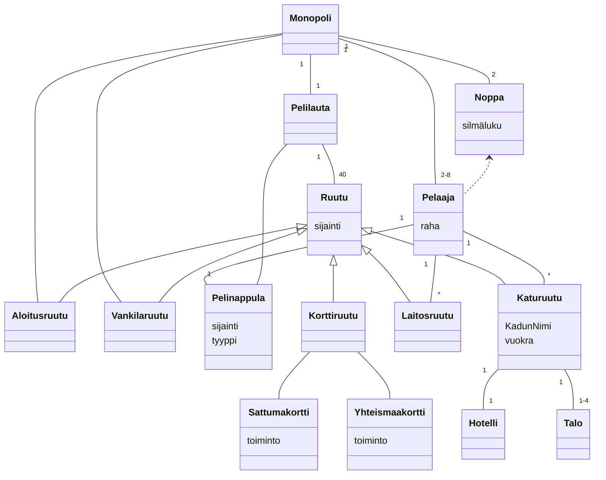

## Monopoli

```mermaid
classDiagram

    Monopoli "1"--"1" Pelilauta
    Monopoli "1"--"2-8" Pelaaja
    Monopoli "1"--"2" Noppa
    Monopoli -- Aloitusruutu
    Monopoli -- Vankilaruutu
    Pelaaja "1"--"1" Pelinappula
    Ruutu <|-- Aloitusruutu
    Ruutu <|-- Vankilaruutu
    Ruutu <|-- Korttiruutu
    Ruutu <|-- Laitosruutu
    Ruutu <|-- Katuruutu
    Pelilauta "1" -- "40" Ruutu
    Pelilauta -- Pelinappula
    Korttiruutu -- Sattumakortti
    Korttiruutu -- Yhteismaakortti
    Noppa <.. Pelaaja
    Pelaaja "1" -- "*" Katuruutu
    Pelaaja "1" -- "*" Laitosruutu
    Katuruutu "1"--"1" Hotelli
    Katuruutu "1"--"1-4" Talo

    
    class Monopoli{

    }
    class Pelaaja{
        raha
    }
    class Noppa{
        silmäluku
    }
    class Pelilauta{

    }
    class Ruutu{        
        sijainti
        
    }
    class Aloitusruutu{

    }
    class Vankilaruutu{

    }
    class Korttiruutu{

    }
    class Laitosruutu{

    }
    class Katuruutu{
        KadunNimi
        vuokra
    }
    class Pelinappula{
        sijainti
        tyyppi
    }
    class Sattumakortti{
        toiminto
    }
    class Yhteismaakortti{
        toiminto
    }
    class Hotelli{
        
    }
    class Talo{
        
    }

```

