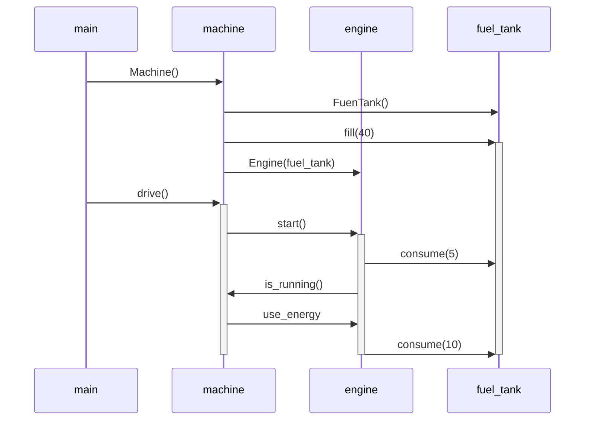

## Machine-sekvenssikaavio

```mermaid
sequenceDiagram

    participant main
    participant machine
    participant engine
    participant fuel_tank

    main ->> machine: Machine()
    machine ->> fuel_tank: FuenTank()        
    machine ->>+ fuel_tank: fill(40)
    machine ->> engine: Engine(fuel_tank)
    main ->>+ machine: drive()
    machine ->>+ engine: start()
    engine ->> fuel_tank: consume(5)
    engine ->> machine: is_running()
    machine ->> engine: use_energy
    engine ->> fuel_tank: consume(10)

    
    deactivate machine
    deactivate fuel_tank
    deactivate engine
```