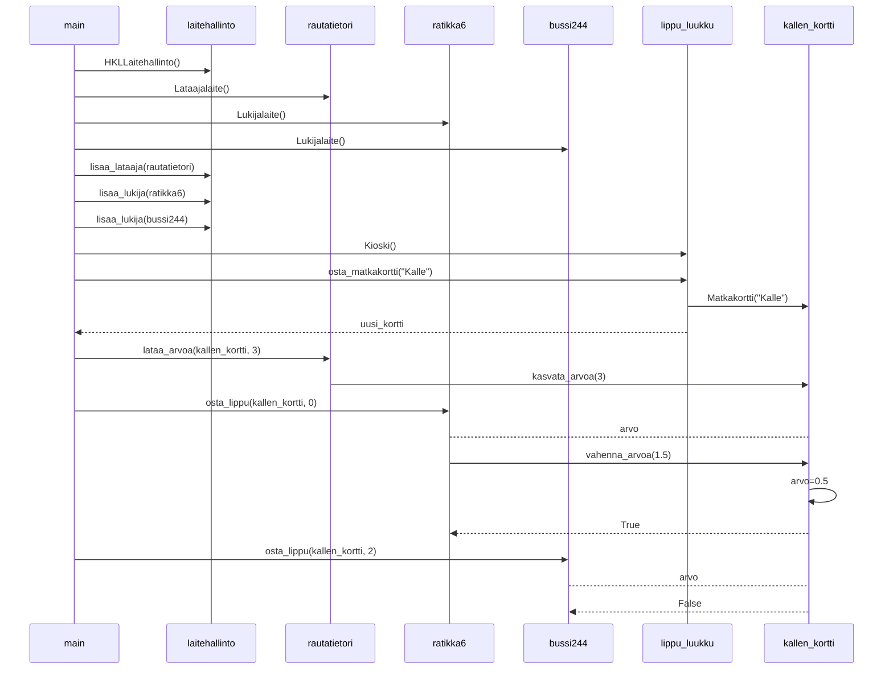

## matkakortti-sekvenssikaavio

```mermaid
sequenceDiagram

    participant main
    participant laitehallinto
    participant rautatietori
    participant ratikka6
    participant bussi244    
    participant lippu_luukku
    participant kallen_kortti
    
    main ->> laitehallinto: HKLLaitehallinto()
    main ->> rautatietori: Lataajalaite()
    main ->> ratikka6: Lukijalaite()
    main ->> bussi244: Lukijalaite()
    main ->> laitehallinto: lisaa_lataaja(rautatietori)
    main ->> laitehallinto: lisaa_lukija(ratikka6)
    main ->> laitehallinto: lisaa_lukija(bussi244)
    main ->> lippu_luukku: Kioski()
    main ->> lippu_luukku: osta_matkakortti("Kalle")
    
    lippu_luukku ->> kallen_kortti: Matkakortti("Kalle")
    lippu_luukku -->> main: uusi_kortti
    main ->> rautatietori: lataa_arvoa(kallen_kortti, 3)
    rautatietori ->> kallen_kortti: kasvata_arvoa(3)
    main ->> ratikka6: osta_lippu(kallen_kortti, 0)
    ratikka6 --> kallen_kortti: arvo
    ratikka6 ->> kallen_kortti: vahenna_arvoa(1.5)
    kallen_kortti ->> kallen_kortti: arvo=0.5
    kallen_kortti -->> ratikka6: True
    main ->> bussi244: osta_lippu(kallen_kortti, 2)
    bussi244 --> kallen_kortti: arvo
    kallen_kortti -->> bussi244: False

```